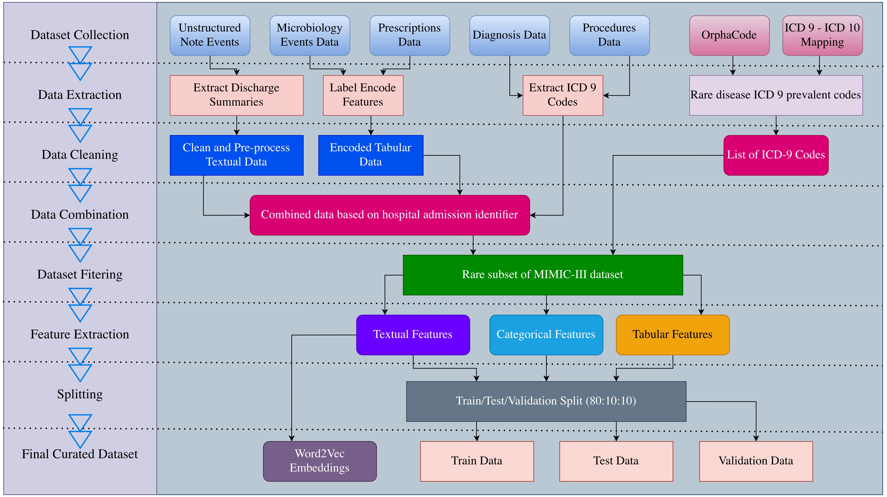

# MMAC-Net

Official implementation of **"MMAC-Net: A Multi-Modal Multi-Label Attention Based Deep Learning
Approach to Diagnose Rare Diseases from Electronic Health Records."**

MMAC-Net predicts ICD-9 diagnosis/procedure codes — with a particular focus on **rare** disease
codes — from MIMIC-III electronic health records by fusing clinical notes (via an attention-based
convolutional text encoder) with structured/tabular admission features.

<p align="center">
  
</p>

This codebase builds on the architecture and training utilities of the
[ICD Coding Benchmark](https://github.com/dalgu90/icd-coding-benchmark) (Kim, Sharma, Shanbhogue),
extended with multi-modal (text + tabular) fusion, squeeze-and-excitation / residual convolution
blocks, and graph-based label encoders.

## Repository layout

```
MMACNet/                 Library code (models, datasets, preprocessing, training, utils)
  models/                 MMACNet.py, MMACNetGNN.py, MMACNet_GCN.py — see "Model variants" below
  modules/                 Preprocessing pipelines, tokenizers, embeddings, losses, schedulers
  trainers/                Training / evaluation loop
  utils/                   Config loading, checkpointing, logging, mapper registry
configs/
  preprocessing/default/   Preprocessing configs (raw MIMIC-III -> datasets/mimic3_full/)
  MMACNet/                 Model/training configs
datasets/                  Not tracked in git — see datasets/README.md
figs/                      Figures used in this README / the paper
scripts/                   Standalone helper scripts (see below)
logs/                      Text logs from preprocessing/training/eval runs (gitignored)
run.py / run_preprocessing.py   Entry points
```

## Setup

```
$ pip install -r requirements.txt
```

## Data preparation

MIMIC-III is a credentialed, restricted-access dataset. You must obtain your own access via
[PhysioNet](https://physionet.org/content/mimiciii/1.4/) and agree to its data use agreement —
this repository never ships raw or derived patient data (`datasets/` is gitignored; see
[`datasets/README.md`](datasets/README.md) for the expected layout).

By default, configs look for the raw `csv.gz` exports under `datasets/mimic3/csv/` and the
official train/val/test admission-ID splits under `datasets/mimic3/static/`. Both are
overridable via environment variables so you never need to hardcode a personal or cluster path
in a config file that gets committed to git:

```
$ export MIMIC_CSV_DIR=/path/to/your/mimic3/csv
$ export MIMIC_STATIC_DIR=/path/to/your/mimic3/static
```

(Config files reference these as `${MIMIC_CSV_DIR:-datasets/mimic3/csv}`, so unset variables just
fall back to the in-repo default path.)

## Pre-processing

```
$ python run_preprocessing.py --config_path configs/preprocessing/default/mimic3_full.yml
```

This writes `train.json` / `val.json` / `test.json`, `labels.json`, `tabular_meta.json`, and
word2vec embeddings under `datasets/mimic3_full/`. A variant that keeps the full ~8,900-code label
space (instead of the rare-disease-focused subset) is available via
`configs/preprocessing/default/mimic3_full_all_codes.yml`.

### Label graph (for the GNN / GCN label encoders)

`MMACNetGNN` and `MMACNet_GCN`'s graph-based label encoders need a label co-occurrence/similarity
graph, built from label description embeddings after pre-processing:

```
$ python scripts/generate_label_graph.py --dataset_dir datasets/mimic3_full
```

This writes `datasets/mimic3_full/label_graph.npy`, referenced by configs via `label_graph_path`.

## Training / Testing

```
$ python run.py --config_path configs/MMACNet/MMACNet_mimic3_full.yml         # Train
$ python run.py --config_path configs/MMACNet/MMACNet_mimic3_full.yml --test  # Test
```

Other available configs:
- `configs/MMACNet/MMACNet_mimic3_full_all_codes.yml` — full ICD-9 label space (no rare-disease filtering)
- `configs/MMACNet/MMACNetGNN_mimic3_full.yml` — graph-based label encoder (`label_encoder_type: dir`, requires `label_graph.npy`)

Training is logged through TensorBoard (under `results/<config_name>/`), and checkpoints/test
metrics are written there too. Text logs for preprocessing, training, and evaluation runs go to
`logs/`.

An example multi-GPU SLURM submission script is at [`scripts/job.slurm`](scripts/job.slurm) —
adapt the `#SBATCH` directives and module name to your own cluster.

## Model variants

Three model files live under `MMACNet/models/`, reflecting the project's iterative development:

- **`MMACNet.py`** — the original single-modality (text-only) attention model.
- **`MMACNetGNN.py`** — an early graph-based label-encoder prototype.
- **`MMACNet_GCN.py`** — the current, consolidated implementation. This is the only model file
  imported by `MMACNet/models/__init__.py`, and it registers all three model names used by the
  configs above (`MMACNet`, `CNN`, `MMACNetGNN`). It adds multi-modal (text + tabular) fusion,
  squeeze-and-excitation / residual / depthwise-separable convolution blocks, and a configurable
  label-graph encoder (`label_encoder_type: gcn | dir | gps`) selectable per model config.

## Dataset analysis

`scripts/analyze_dataset.py` profiles the raw MIMIC-III export (demographics, length of stay,
rare vs. all-code comparisons) and writes summary tables to `results/dataset_analysis/` and
figures to `figs/dataset_analysis/`:

```
$ python scripts/analyze_dataset.py --csv-dir "$MIMIC_CSV_DIR"
```

A snapshot from the last run (58,976 admissions / 46,520 patients total; 39,304 admissions /
31,515 patients involve at least one rare ICD-9 code):

| Metric                              | All    | Rare   |
|--------------------------------------|--------|--------|
| Admissions                           | 58,976 | 39,304 |
| Unique patients                      | 46,520 | 31,515 |
| Distinct ICD-9 codes                 | 6,947  | 618    |
| Mean age                             | 53.5   | 60.5   |
| Unique ICD-9 codes per admission (avg)| 11.04  | 1.69   |

See `figs/dataset_analysis/` for the corresponding demographic, length-of-stay, and rare-disease
frequency plots.

## Results

Baseline ICD-coding comparison on the MIMIC-III dataset (568/8,921-code label space), reproduced from the
underlying [ICD Coding Benchmark](https://github.com/dalgu90/icd-coding-benchmark) architectures:

| Model        |     macro AUC      |     micro AUC      |      macro F1      |      micro F1      |         P@8        |        P@15        |
|--------------|--------------------|--------------------|--------------------|--------------------|--------------------|--------------------|
| CNN          | 0.835&plusmn;0.001 | 0.974&plusmn;0.000 | 0.034&plusmn;0.001 | 0.420&plusmn;0.006 | 0.619&plusmn;0.002 | 0.474&plusmn;0.004 |
| CAML         | 0.893&plusmn;0.002 | 0.985&plusmn;0.000 | 0.056&plusmn;0.006 | 0.506&plusmn;0.006 | 0.704&plusmn;0.001 | 0.555&plusmn;0.001 |
| MultiResCNN  | 0.912&plusmn;0.004 | 0.987&plusmn;0.000 | 0.078&plusmn;0.005 | 0.555&plusmn;0.004 | 0.741&plusmn;0.002 | 0.589&plusmn;0.002 |
| DCAN         | 0.848&plusmn;0.009 | 0.979&plusmn;0.001 | 0.066&plusmn;0.005 | 0.533&plusmn;0.006 | 0.721&plusmn;0.001 | 0.573&plusmn;0.000 |
| TransICD     | 0.886&plusmn;0.010 | 0.983&plusmn;0.002 | 0.058&plusmn;0.001 | 0.497&plusmn;0.001 | 0.666&plusmn;0.000 | 0.524&plusmn;0.001 |
| Fusion       | 0.910&plusmn;0.003 | 0.986&plusmn;0.000 | 0.081&plusmn;0.002 | 0.560&plusmn;0.003 | 0.744&plusmn;0.002 | 0.589&plusmn;0.001 |
| MMACNet      | 0.889              | 0.985              | 0.641              | 0.724              | 0.875              | -                  |

Per-run test metrics for MMAC-Net's own rare-disease task are written to
`results/<config_name>/test_result.json` after `run.py --test`; training/validation loss curves
are saved under `figs/` (e.g. `figs/train_vs_val_loss_rare.png`).


## Authors

- Adnan Ferdous Ashrafi [@ashrafi91](https://github.com/ashrafi91)

## Code helpers from public repos

- Also referred to as medical coding, clinical coding, or simply ICD coding in other literature. They may have different meanings in detail.
- Mullenbach, et al., Explainable Prediction of Medical Codes from Clinical Text, NAACL 2018 ([paper](https://arxiv.org/abs/1802.05695), [code](https://github.com/jamesmullenbach/caml-mimic))
- Li and Yu, ICD Coding from Clinical Text Using Multi-Filter Residual Convolutional Neural Network, AAAI 2020 ([paper](https://arxiv.org/abs/1912.00862), [code](https://github.com/foxlf823/Multi-Filter-Residual-Convolutional-Neural-Network))
- Ji, et al., Dilated Convolutional Attention Network for Medical Code Assignment from Clinical Text, Clinical NLP Workshop 2020 ([paper](https://aclanthology.org/2020.clinicalnlp-1.8/), [code](https://github.com/shaoxiongji/DCAN))
- Biswas, et al., TransICD: Transformer Based Code-wise Attention Model for Explainable ICD Coding, AIME 2021 ([paper](https://arxiv.org/abs/2104.10652), [code](https://github.com/AIMedLab/TransICD))
- Luo, et al., Fusion: Towards Automated ICD Coding via Feature Compression, ACL 2020 Findings ([paper](https://aclanthology.org/2021.findings-acl.184/), [code](https://github.com/machinelearning4health/Fusion-Towards-Automated-ICD-Coding))
- Kim, Sharma, Shanbhogue, [ICD Coding Benchmark](https://github.com/dalgu90/icd-coding-benchmark) (base architecture and training framework this project extends)
